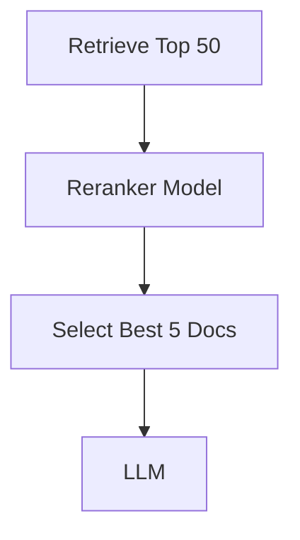
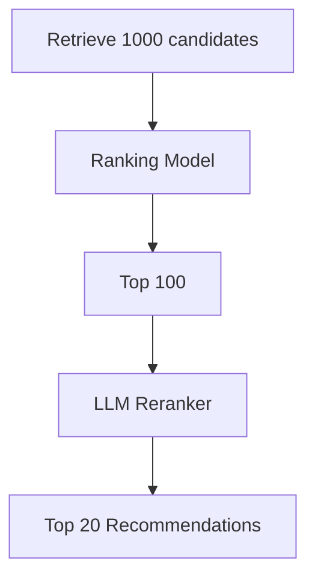
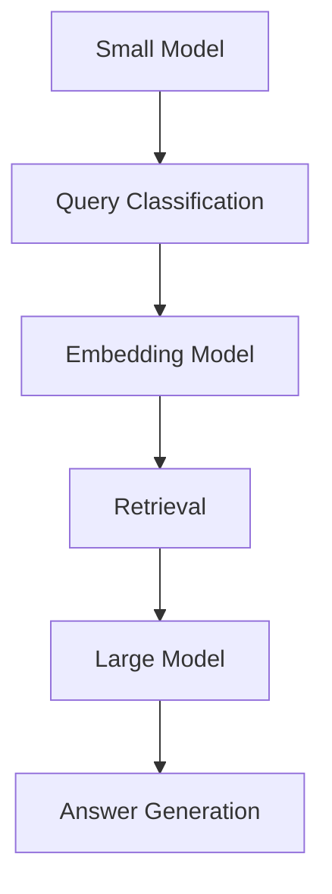
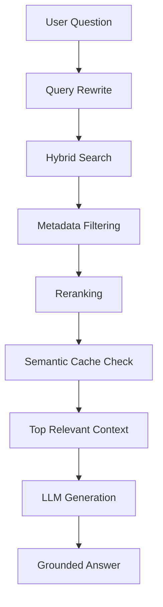
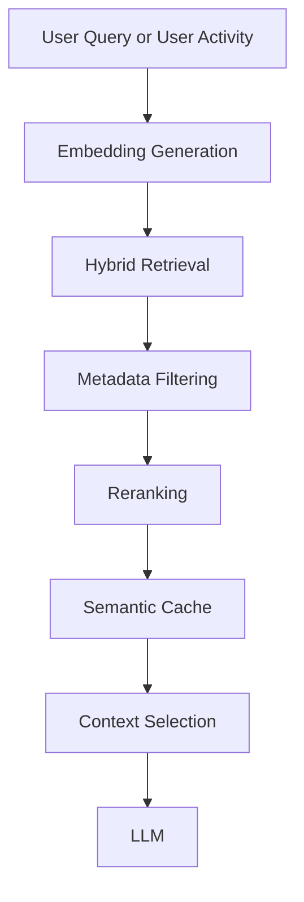

# Optimization Methods in Semantic AI Pipelines
Optimization is not just about making the LLM faster. It is about improving the quality, relevance 
and efficiency of the entire pipeline. Depending on the use case, these optimizations may improve either:
* Search & Retrieval Precision (RAG)
* Recommendation Precision

## **1. Query Optimization:**
Before sending query to the retriever, rewrite or enrich it.

**User Query:** "why are users not watching this show?"

** Optimized Query:**
```
viewer engagement decline
show completion rate
content recommendation performance
audience retention metrics
```
This improves retrieval precision because the search uses richer context.

** Benefits **
- Better document retrieval
- Higher answer accuracy
- Reduced irrelevant results

## **2. Chunking Optimization: **
Large documents are split into smaller chunks before indexing.

** Poor Chunking **
```
Entire Netflix recommendation guide
(50 pages in one chunk)
```
** Optimized Chunking **
```
Chunk 1: User Behaviour Signals
Chunk 2: Collaborative Filtering
Chunk 3: Content Similarity
Chunk 4: Ranking Models
```
The retriever can now identify the most relevant section rather than searching an entire document.

** Benefits ** 
- Higher retrieval accuracy
- Lower token usage
- Faster response times

## **3. Embedding Optimization**
Choose embeddings that match the domain.
Search Example:
```
**User Query:** How do recommendation rankings work?

Embedding finds:
- Ranking Models
- Recommendation Scoring
- User Affinity Models
```
VS
```
Media and entertainment specific embeddings
```
A better embedding model produces vectors that capture domain-specific meaning more accurately.

Recommendation Example:
```
User watched:
- Stranger Things
- Dark
- Wednesday
```
**Embedding Retrieval**

Find content with similar semantic characteristics:
```
Science Fiction
Mystery
Supernatural
Suspense
```
**Recommendation Results:**
- 3 Body Problem
- The OA
- Sense8
```
Even if genres and keywords do not exactly match, semantic embeddings identify similar content.

**Benefits**
- Better semantic search
- Improved relevance ranking
- More precise context/recommendation retrieval

## **4. Metadata Filtering**

Use structured metadata to narrow the search space.
Search Example Metadata:
```json
{
  "region": "Australia",
  "content_type": "Series"
}
```
Instead of searching all documents:
```
Search entire knowledge base
```
Search only:
```
Australian science-fiction series documents

Recommendation Example metadata:
```json
{
  "region": "Australia",
  "subscription": "Premium",
  "content_type": "Series",
  "genre": "Science Fiction"
}
```
Without filtering:
```
1. Stranger Things
2. Dark
3. Content not available in Australia
4. Premium-only documentary
5. Movie instead of series
```
After filtering:
```
1. Stranger Things
2. Dark
3. 3 Body Problem
4. Wednesday
5. Black Mirror
```
Recommend only content available and relevant to that user.

```
** Benefits **
- Reduce noise
- Faster retrieval
- Improved precision

## **5. Hybrid Retrieval Optimization **
Combine semantic retrieval and keyword retrieval.
Search Example:
** Query:** `How does titleId=80057281 get ranked?`
Keyword search finds: `80057281`
Semantic search finds:
```
ranking logic
viewer interest or content similarity
recommendation score
```
Recommendation Example:
Candidate retrieval combines:
```
Collaborative Filtering
+
Content Similarity
+
Popularity Signals
```
**User watched:**
```
Recently watched:
- Stranger Things
```
** Keyword/Metadata Signals**
```
Science Fiction
Mystery
Teen Drama
```
** Semantic Signals **
```
Dark atmosphere
Supernatural themes
Small-town mystery
```
** Recommendation Result ** 
```
1. Dark
2. Wednesday
3. The OA
4. Locke & Key
5. Black Spot
```
The keyword approach alone may return generic Sci-Fi content, 
while semantic retrieval finds shows with similar themes and viewing patterns.
So combining them often gives better results than either alone.

** Benefits **
- Better recall
- Better precision
- Handles exact matches like IDs and semantic matches

## **6. Reranking or Multi-Stage Ranking Optimization**
Retrieve many documents first and then rerank them. Retrieve broadly, then optimize precision.
Search Example:

Recommendation Example:

** Candidate Retrieval** 100 titles
** Ranking Model ** Top 100 titles
** LLM Reranker** 
Considers:
```
User preferences
Recent activity
Viewing completion
Content similarity
```
**Final Recommendation Result**
```
1. 3 Body Problem
2. Dark
3. The OA
4. Sense8
5. Wednesday
```
The reranker focuses only on truly relevant finds. The modst relevant document or titles appear at the top.

** Benefits**
- Removes irrelevant context
- Improves answer quality
- Reduces hallucinations truly relevant finds.

## **7. Semantic Caching**
Store answers to previously asked similar questions and reuse them.
Example:
```
User A:
Why is Stranger Things recommended?

User B:
Why do I keep seeing Stranger Things?
```
Both questions have similar meaning.

Instead of re-running the entire pipeline:
```
Retrieve cached results.

Recommendation Example:
```
User Segment:
Sci-Fi Fans
```
Previously computed recommendation candidates can be reused.

```
**Benefits**
- Lower latency
- Reduced LLM cost
- Faster responses

## **8. Context Window Optimization**
Avoid sending unnecessary content to the LLM. Use real-time user or business context.
Instead of:
```
10 retrieved documents
5000 tokens
```
send:
```
Top 3 most relevant chunks
800 tokens
```
Recommendation Example:
Context:
```json
{
  "region": "Australia",
  "device": "TV",
  "time": "Evening"
}
```
Morning result:
1. Children's Animation
2. Educational Series
3. Family Programs
```
Evening result:
```
1. Stranger Things
2. Wednesday
3. Dark
```
Recommendations adapt to context, increasing relevance.
```
**Benefits**
- Lower token cost
- Faster inference
- Better focus on relevant evidence
- More personalized results

## **9. Graph-Based Optimization**
Leverage relationships between entities. Provide related content.
** Search Example **
```
Document
    ↓
Related Topic
    ↓
Related Topic
```
Graph traversal can discover additional relevant context.
**Recommendation Example**
Graph Relationships:
```
User
  ↓ watches
Stranger Things
  ↓ similar audience
Dark
  ↓ similar audience
3 Body Problem
```
** Recommendation Result **
```
1. Dark
2. 3 Body Problem
3. The OA
4. Black Mirror
```
** Result **
The graph discovers relevant content even when metadata overlap is limited.

## **10. Model Optimization**
Use the right model for the task or Use different models for diff tasks.
Example:

Not every step requires the largest LLM.

**Benefits**
- Lower infrastructure cost
- Faster responses
- Better scalability

** Example: Optimized Netflix RAG Pipeline **
Search:

Recommendations:

Example Question: Why is Stranger Things recommended to me?
Search Example:
Pipeline:
```
Embedding Search
→ Metadata Filtering
→ Reranking
→ LLM Answer
```
Results: Grounded answer using licensing and regional-availability documents.

Recommendation Example:
```
User watched:
- Dark
- Stranger Things
- Wednesday
```
Pipeline:
```
Candidate Retrieval
→ Metadata Filtering
→ Ranking
→ LLM Reranking
→ Final Recommendations
```
Result:
```
Recommended:
- 3 Body Problem
- The OA
- Sense8
```


**Result**
The LLM receives only the most relevant recommendation-policy documents and viewing-behaviour data,
producing a faster, more accurate, and grounded answer.


