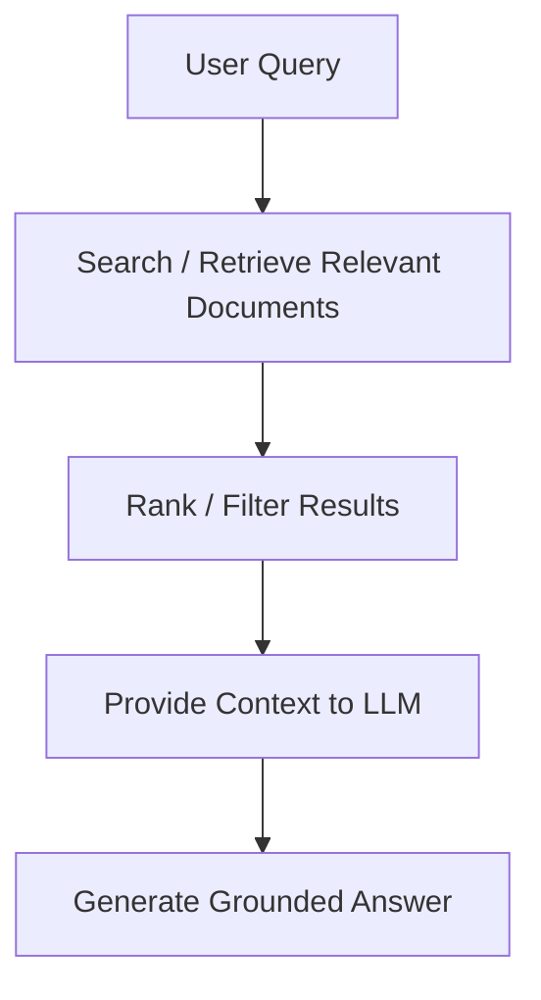
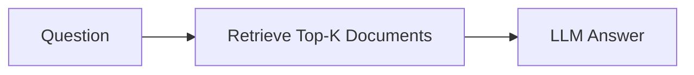
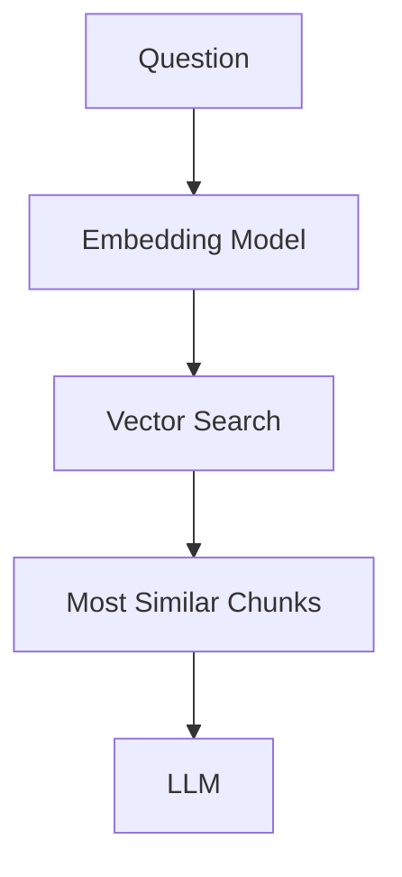
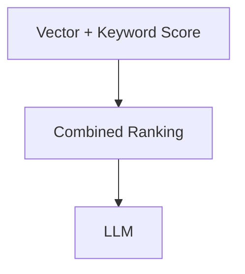
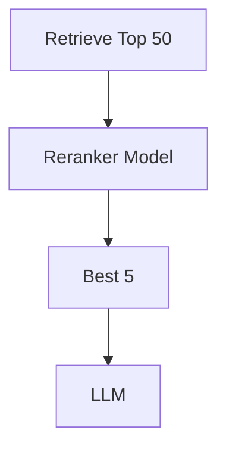
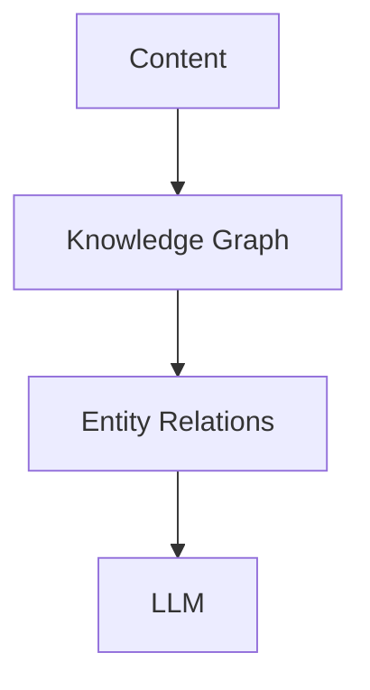
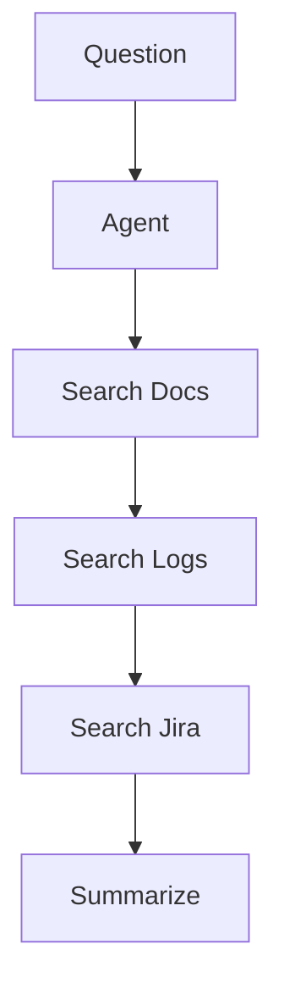
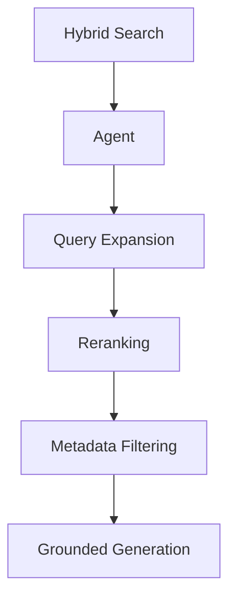

RAG stands for Retrieval-Augmented Generation. 
RAG is a technique that improves LLM accuracy by retrieving relevant information from trusted sources before generating a response. In this document, recommendation-system examples are used to illustrate how RAG can retrieve and explain recommendation-related information. The focus is on improving the accuracy of generated answers rather than generating recommendations themselves.

# Basic RAG Flow

Instead of relying only on what the model learned during training, the LLM uses retrieved content from:
* Knowledge bases
* Company documents
* Databases
* Wikis
* APIs
* Search indexes
* Vector databases

## Common RAG Techniques

**1. Naive RAG (Basic Retrieval)**
The simplest form.

Example:
Query: "Why is Stranger Things recommended to viewers who watch science fiction shows?"
- Recommendation strategy document
- User engagement metrics
- Stranger Things metadata
- Genre classification guide
- Viewing pattern report

Pass documents to LLM

Generate answer


| Aspect | Details |
|---|---|
| **Pros** | Easy to implement |
| **Cons** | Can retrieve irrelevant information; lower precision |

**2. Semantic Search RAG**
Uses embeddings and vector similarity.

This is what most modern AI pipelines use.

Example:
Query: "Why do users who enjoy dark science fiction often receive Stranger Things recommendations?"

Returns documents containing:
- supernatural drama
- mystery thriller
- viewer affinity scoring
- recommendation models
even if exact words don't match.

| Aspect | Details |
|---|---|
| **Pros** | - Understands meaning, not just keywords<br> - Better recall for natural-language queries |

**3. Hybrid Search RAG**
Combines:
* Semantic search (vector)
* Keyword search (BM25/Lucene)

This is often the highest precision approach for enterprise systems.
Why?
Keyword search finds:
- Ticket IDs
- Catalog IDs
- URLs
- Show names
Semantic search finds:
- Conceptual matches
- Similar meanings
- Viewer interests
- Content relationships

**4. Reranking RAG**
A second model re-ranks retrieved results.

Example:
Initial retrieval:
- Stranger Things Metadata
- User Viewing Behaviour Guide
- Payment Platform Documentation
- Recommendation Algorithm Guide
- Licensing Information
Reranker determines only items 1, 2 and 4 are truly relevant.

| Aspect | Details |
|---|---|
| **Result** | Much higher precision. |

**5. Contextual RAG**
Adds business context before retrieval.
Example Context:
```json
{
  "region": "Australia",
  "subscription": "Premium",
  "device": "Smart TV"
}
```
Now retrieval becomes more specific.

Without context: "movie unavailable"
Returns hundreds of results.

With context: "movie unavailable on Premium plan in Australia"
Returns much more precise documents.

**6. Query Expansion RAG**
LLM rewrites the user's question into better search queries.

Example:

User asks: "Why are viewers not receiving certain recommendations?"
Expanded queries:
```
missing recommendations
recommendation suppression
content eligibility filtering
viewer preference mismatch
cold start problem
```
This improves retrieval coverage.

**7. Multi-Hop RAG**
Used when a single document cannot answer the question.

Example:
Question: "Why was a movie removed from recommendations after a licensing update?"

Need information from:
- Licensing database
- Recommendation engine logs
- Content catalog metadata
- Regional availability records

The system retrieves evidence across multiple sources and combines it.

**8. Graph RAG**
Uses knowledge graphs instead of only vectors.

Good for understanding relationships such as:
```
Series
 ├─ has genre → Science Fiction
 ├─ produced by → Production Studio
 ├─ similar to → Dark
 └─ watched by → User Segment
 ```
Useful in recommendation and content-discovery systems.

**9. Agentic RAG**
The most advanced form.

The LLM decides:
- What to search
- Where to search
- Whether results are sufficient
- Whether another search is needed

Example:
- Search Content Catalog
- Search Recommendation Logs
- Search Licensing Records
- Search Viewer Engagement Data
- Generate root-cause explanation

## RAG Techniques That Improve Precision
If your goal is precision in a semantic AI pipeline, the most effective stack is usually:


Example Flow:

```text
User Question: Why is Stranger Things recommended to Australian viewers who watch science-fiction content?

1. Query Expansion
2. Hybrid Search
3. Metadata Filtering (Region = Australia)
4. Reranking
5. Retrieve recommendation-policy documents
6. Retrieve regional availability information
7. Retrieve viewer-affinity reports
8. Ground LLM response on retrieved evidence
9. Generate answer with citations
```

**Result:**
The AI retrieves recommendation guidelines, audience-behaviour reports, and regional content metadata. Using this evidence, it explains that Stranger Things is recommended because viewers with similar viewing patterns frequently engage with science-fiction, mystery, and supernatural content. The response is generated from retrieved recommendation evidence and regional availability data, ensuring that the explanation is accurate and grounded.


