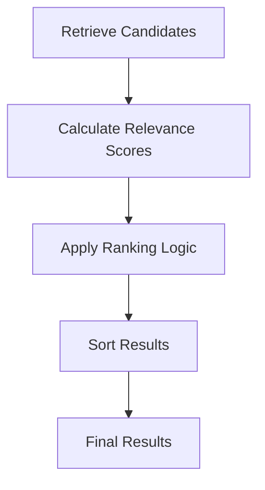
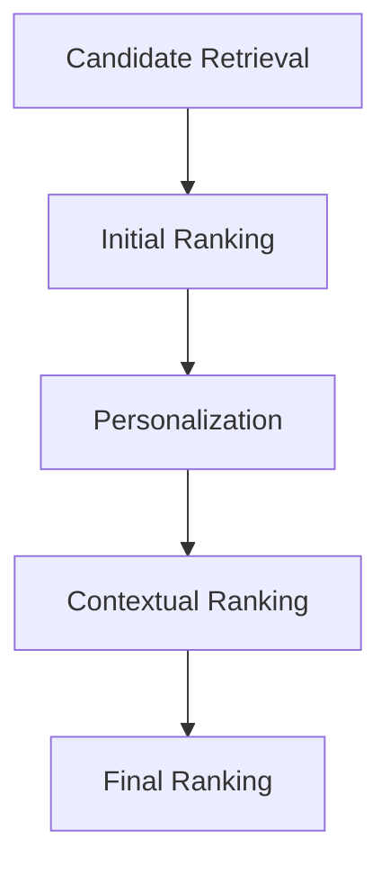

# Ranking Techniques in Semantic AI Pipelines
Ranking is the process of ordering retrieved information based on relevance, quality, and user context.
In semantic AI pipelines, retrieval focuses on finding potentially relevant content, while ranking determines 
which results should appear first.

Effective ranking improves:
- Search relevance
- Recommendation quality
- User satisfaction
- Personalization
- Precision

Ranking techniques can be applied to both:
- Search Systems
- Recommendation Systems

## Why Ranking Matters
Retrieval often returns many possible candidates.

### Search Example
Search query: Why is Stranger Things recommended?

Retrieved:
```
Document A
Document B
Document C
Document D
Document E
```
Not all documents are equally relevant.
Ranking determines which documents should be presented first.

### Recommendation Example
User recently watched: 
```
Stranger Things
Dark
Wednesday
```
Retrieved candidates:
```
3 Body Problem
The OA
Sense8
Friends
Nature Documentary
```
Ranking determines which titles are most likely to be relevant to the user.

# Basic Ranking Flow



---

# 1. Relevance-Based Ranking

The simplest ranking approach.

Candidates are sorted based on relevance scores.

## Search Example

Query:

```text
How are recommendation scores calculated?
```

Documents:

```text
Recommendation Guide (95%)
Licensing Policy (20%)
Content Metadata (70%)
```

Ranked Result:

```text
1. Recommendation Guide
2. Content Metadata
3. Licensing Policy
```

---

## Recommendation Example

User likes:

```text
Science Fiction
Mystery
```

Candidate Scores:

```text
3 Body Problem = 95
The OA = 90
Nature Documentary = 15
```

Ranked Result:

```text
1. 3 Body Problem
2. The OA
3. Nature Documentary
```

---

# 2. Semantic Ranking

Uses embeddings and vector similarity.

Instead of matching keywords, semantic ranking measures meaning.

## Search Example

Query:

```text
Why are viewers receiving Stranger Things recommendations?
```

Semantic Ranking:

```text
Viewer Affinity Report
Recommendation Policy Guide
Content Metadata
```

Even if the exact words are not present.

---

## Recommendation Example

Watched:

```text
Dark
```

Semantic Similarity Finds:

```text
Stranger Things
3 Body Problem
The OA
```

Because the content shares themes and audience interests.

### Benefits

- Better relevance
- Better understanding of intent
- Reduced keyword dependency

---

# 3. Personalized Ranking

Results are adjusted based on user preferences.

## Search Example

User Role:

```text
Business Analyst
```

Search:

```text
Recommendation performance
```

Rank higher:

```text
Analytics Reports
Performance Dashboards
```

---

## Recommendation Example

User History:

```text
Stranger Things
Dark
Wednesday
```

Personalized Result:

```text
1. 3 Body Problem
2. The OA
3. Black Mirror
```

Different users may receive different rankings.

### Benefits

- Personalized results
- Improved engagement
- Higher relevance

---

# 4. Contextual Ranking

Ranking incorporates real-time context.

## Search Example

Context:

```json
{
  "region": "Australia"
}
```

Query:

```text
Content availability
```

Australian content policies are ranked higher.

---

## Recommendation Example

Context:

```json
{
  "device": "TV",
  "time": "Evening"
}
```

Rank Higher:

```text
Series
Long-form content
```

Instead of:

```text
Short clips
Mobile-first content
```

### Benefits

- More accurate ranking
- Better real-time relevance
- Improved user experience

---

# 5. Hybrid Ranking

Combines multiple ranking signals.

Example signals:

```text
Keyword Match
Semantic Similarity
Popularity
Business Rules
Personalization
```

---

## Search Example

Query:

```text
Recommendation engine architecture
```

Ranking Formula:

```text
40% Semantic Similarity
30% Keyword Match
20% Freshness
10% Popularity
```

---

## Recommendation Example

Ranking Formula:

```text
40% Content Similarity
30% User Affinity
20% Watch Trends
10% Recency
```

This often produces better results than relying on a single signal.

### Benefits

- Better overall precision
- Balanced ranking
- Improved relevance

---

# 6. Learning-to-Rank (LTR)

Uses machine learning to optimize ranking decisions.

The model learns from historical interactions.

Example signals:

```text
Clicks
Views
Watch Time
Completion Rate
Likes
```

---

## Search Example

Documents frequently clicked after a search query move higher in rankings.

For example:

```text
Search Query:
Recommendation performance

Frequently Opened:
Recommendation Analytics Guide
```

This guide will gradually rank higher.

---

## Recommendation Example

Content with strong engagement patterns receives higher ranking scores.

Examples:

```text
Watch Completion
Rewatch Rate
User Retention
```

Ranked Result:

```text
1. 3 Body Problem
2. Black Mirror
3. The OA
```

### Benefits

- Learns from user behaviour
- Continuously improves
- Adapts to new trends

---

# 7. Graph-Based Ranking

Uses relationships between entities.

## Search Example

```text
Recommendation Guide
        ↓
Recommendation Models
        ↓
Viewer Engagement Metrics
```

Documents connected to highly relevant entities receive higher scores.

---

## Recommendation Example

```text
User
  ↓ watched
Stranger Things
  ↓ shared audience
Dark
  ↓ shared audience
3 Body Problem
```

Ranked Result:

```text
1. Dark
2. 3 Body Problem
3. The OA
```

### Benefits

- Better content discovery
- Stronger relationship awareness
- Improved recommendations

---

# 8. Diversity Ranking

Ensures results are not overly similar.

## Search Example

Without Diversity:

```text
1. Recommendation Guide v1
2. Recommendation Guide v2
3. Recommendation Guide v3
```

With Diversity:

```text
1. Recommendation Guide
2. Analytics Dashboard
3. Metadata Documentation
4. Policy Documentation
```

---

## Recommendation Example

Without Diversity:

```text
1. Stranger Things Clone
2. Stranger Things Clone
3. Stranger Things Clone
```

With Diversity:

```text
1. 3 Body Problem
2. Black Mirror
3. The OA
4. Dark
```

### Benefits

- Increased discovery
- Reduced repetition
- Better user experience

---

# Multi-Stage Ranking Architecture

Modern semantic AI systems often use multiple ranking stages.



This balances speed and precision.

---

# Example: Search Ranking Pipeline

### User Query

```text
Why is Stranger Things recommended?
```

### Pipeline

```text
1. Retrieve 100 documents
2. Semantic Ranking
3. Contextual Ranking
4. Personalized Ranking
5. Return Top 5 Results
```

### Ranked Results

```text
1. Recommendation Policy Guide
2. Viewer Affinity Report
3. Content Metadata
4. Ranking Methodology
5. Analytics Dashboard
```

### Result

The user receives the most relevant documents first, enabling the LLM or search application to provide a more accurate answer.

---

# Example: Recommendation Ranking Pipeline

### User Activity

```text
Recently Watched:
- Stranger Things
- Dark
- Wednesday
```

### Pipeline

```text
1. Retrieve 1000 candidate titles
2. Semantic Ranking
3. Personalized Ranking
4. Contextual Ranking
5. Diversity Ranking
6. Return Top 10 Recommendations
```

### Ranked Recommendations

```text
1. 3 Body Problem
2. The OA
3. Black Mirror
4. Sense8
5. Archive 81
```

### Result

The recommendation engine surfaces content that best matches the user's interests, viewing behaviour, and current context.

---

### Takeaway

Ranking is the decision-making layer of a semantic AI pipeline. While retrieval identifies potentially relevant information or content, 
ranking determines what is most relevant to the user. By combining semantic ranking, personalization, contextual signals, learning-to-rank, 
graph-based ranking, and diversity optimization, organizations can significantly improve both **search precision** and **recommendation relevance**, 
resulting in more accurate, engaging, and user-centric experiences.


