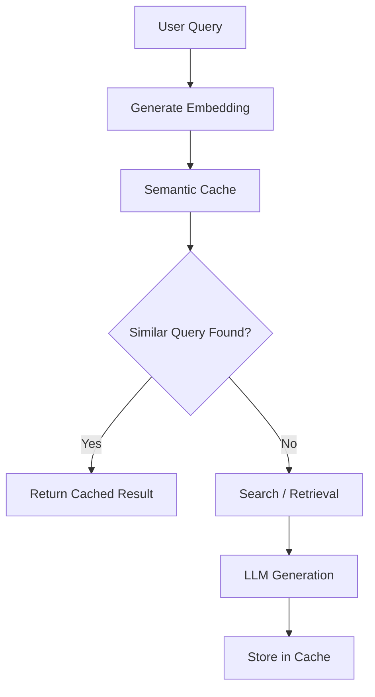
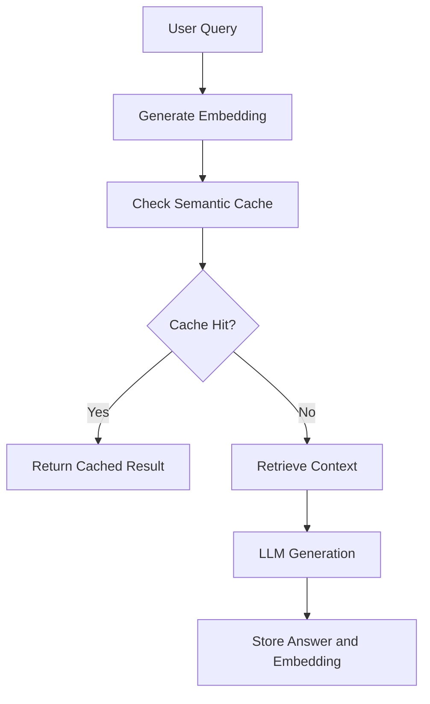

# Semantic Caching in Semantic AI Pipelines

Semantic Caching is a technique that stores previously computed results and reuses them when a new request is semantically similar 
to an earlier request. Unlike traditional caches that rely on exact key matching, semantic caches use vector embeddings and similarity search 
to identify requests with similar meaning. This reduces latency, lowers LLM and retrieval costs, and improves system scalability while maintaining 
high-quality results.

## Why Semantic Caching Matters
Traditional caching works well only when requests are identical.

### Traditional Cache
```
User A:
Why is Stranger Things recommended?

Cache Hit
```
```
User B:
Why do I keep seeing Stranger Things?
```
```
Cache Miss
```
Even though both questions have the same meaning.

### Semantic Cache
```
User A:
Why is Stranger Things recommended?
```
Generate embedding and store result.
```
User B:
Why do I keep seeing Stranger Things?
```
Embedding similarity = 95%
```
Cache Hit
```
Previously generated answer can be reused.

## How Semantic Caching Works


### Components of a Semantic Cache

**Embedding Model**
Converts text into vectors.
Example: Why is Stranger Things recommended?
Now becomes:
[0.34, -0.27, 0.89, ...]

New queries are compared against existing vectors.

**Vector Store**

Stores query embeddings.
Example technologies:
```
Pinecone
Weaviate
OpenSearch
Elasticsearch
FAISS
pgvector
```

**Similarity Search**
Determines whether a query resembles previous requests.
Example: Why is Stranger Things recommended?
and 
Why do I keep getting Stranger Things suggestions?

Similarity Score: 0.95

Cache hit.

## Semantic Caching for Search Systems
Semantic caching can reduce repeated retrieval and LLM work.
Example:
**User A:** Why is Stranger Things unavailable in Australia?
Pipeline:
```
Search Licensing Documents
Search Regional Availability Rules
Generate Answer
Store Result
```
**User B:** Why can't I watch Stranger Things in Australia?
Similarity: 96%

Cache hit.

**Result**
Instead of:
```
Search
Retrieve
Rerank
Generate
```
the system directly returns:
Cached Answer

**Benefits**
- Faster responses
- Reduced search workload
- Reduced LLM costs
- Better scalability

## Semantic Caching for Recommendation Systems
Semantic caching can also improve recommendation performance.
Example:
**User Segment:** Science Fiction Fans
Recent viewing history:
```
Stranger Things
Dark
Wednesday
```
Recommendation engine computes:
```
3 Body Problem
The OA
Black Mirror
Sense8
```
Store result.

**Similar User**
Viewing history:
```
Dark
Stranger Things
1899
```
Similarity: 92 %

Instead of recalculating recommendations:
```
Use Cached Recommendation Candidates
```

**Result**
```
1. 3 Body Problem
2. The OA
3. Black Mirror
4. Sense8
```

**Benefits**
- Faster recommendation generation
- Reduced ranking costs
- Lower infrastructure usage

## Cache Similarity Thresholds
Choosing the right threshold is important.
| Similarity | Action |
| :---: | --- |
| 100% | Exact cache hit |
| 90–99% | Reuse cached response |
| 80–89% | Partial reuse or validation |
| Below 80% | Generate new result |

A threshold that is too low may return incorrect results.
A threshold that is too high reduces cache effectiveness.

## Semantic Cache Strategies

### Query-Level Caching
Store complete answers.
Example: Why is Stranger Things recommended?
Stores: Final generated answer

### Retrieval-Level Caching
Store retrieved documents.
Example: 
```
Recommendation Policy Documents
Viewer Affinity Reports
Metadata Documents
```
LLM still generates the final response.

### Embedding-Level Caching
Store generated embeddings.
Example:
```
Query
  ↓
Embedding
```
Avoid recomputing expensive embeddings repeatedly.

## Context-Aware Semantic Caching
Context should be included when determining cache reuse.
Example
Question: Why is Stranger Things unavailable?
User A:
```json
{
  "region": "Australia"
}
```
**Result**
Licensing restrictions in Australia

User B:
```json
{
  "region": "UK"
}
```
**Result**
Different licensing explanation

Even though the question is identical, contextual differences should prevent incorrect cache reuse.


## Semantic Cache Pipeline


### Takeaway
Semantic Caching improves both Search and Recommendation pipelines by reusing semantically similar results rather than recomputing them from scratch. 
By leveraging embeddings and vector similarity, organizations can reduce latency, lower LLM costs, improve scalability, and deliver faster user experiences 
while maintaining high precision and relevance.

